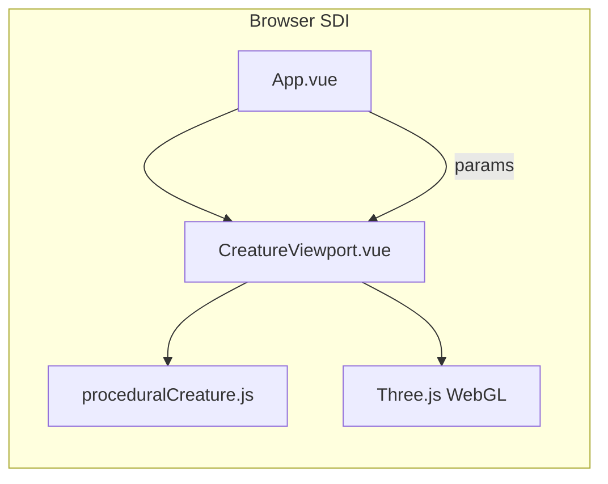

# 组件图（animal-studio）

- **App.vue**：Dock Area、参数表单、`localStorage` 持久化、视图菜单。
- **CreatureViewport.vue**：场景生命周期、相机、ZIP（model.glb + animation.glb + manifest）。
- **proceduralCreature.js**：类型分派与几何构建，无 Vue 依赖。
