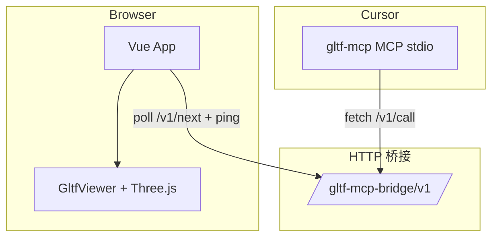

# 组件图（Mermaid）

```mermaid
flowchart TB
  subgraph Cursor
    MCP[gltf-mcp MCP stdio]
  end
  subgraph NodeBridge[HTTP 桥接]
    B[/gltf-mcp-bridge/v1/]
  end
  subgraph Browser
    Vue[Vue App]
    Viewer[GltfViewer + Three.js]
    Vue --> Viewer
  end
  MCP -->|fetch /v1/call| B
  Vue -->|poll /v1/next + ping| B
```
