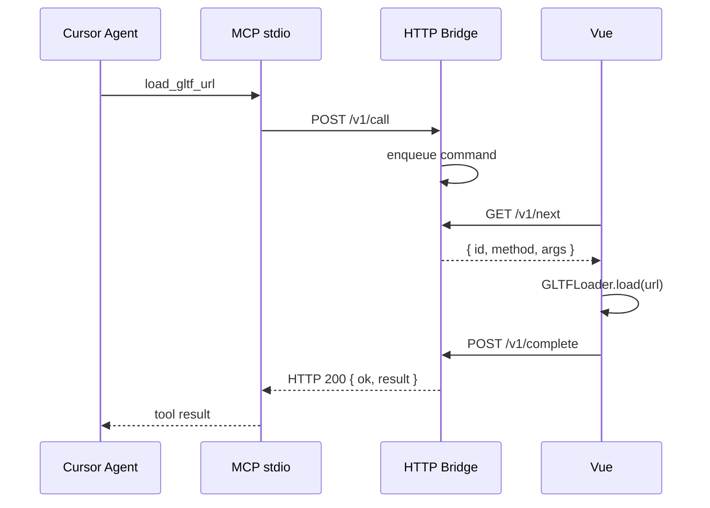

# 序列图：MCP 加载远程模型（Mermaid）

```mermaid
sequenceDiagram
  participant AI as Cursor Agent
  participant M as MCP stdio
  participant H as HTTP Bridge
  participant V as Vue

  AI->>M: load_gltf_url
  M->>H: POST /v1/call
  H->>H: enqueue command
  V->>H: GET /v1/next
  H-->>V: { id, method, args }
  V->>V: GLTFLoader.load(url)
  V->>H: POST /v1/complete
  H-->>M: HTTP 200 { ok, result }
  M-->>AI: tool result
```
