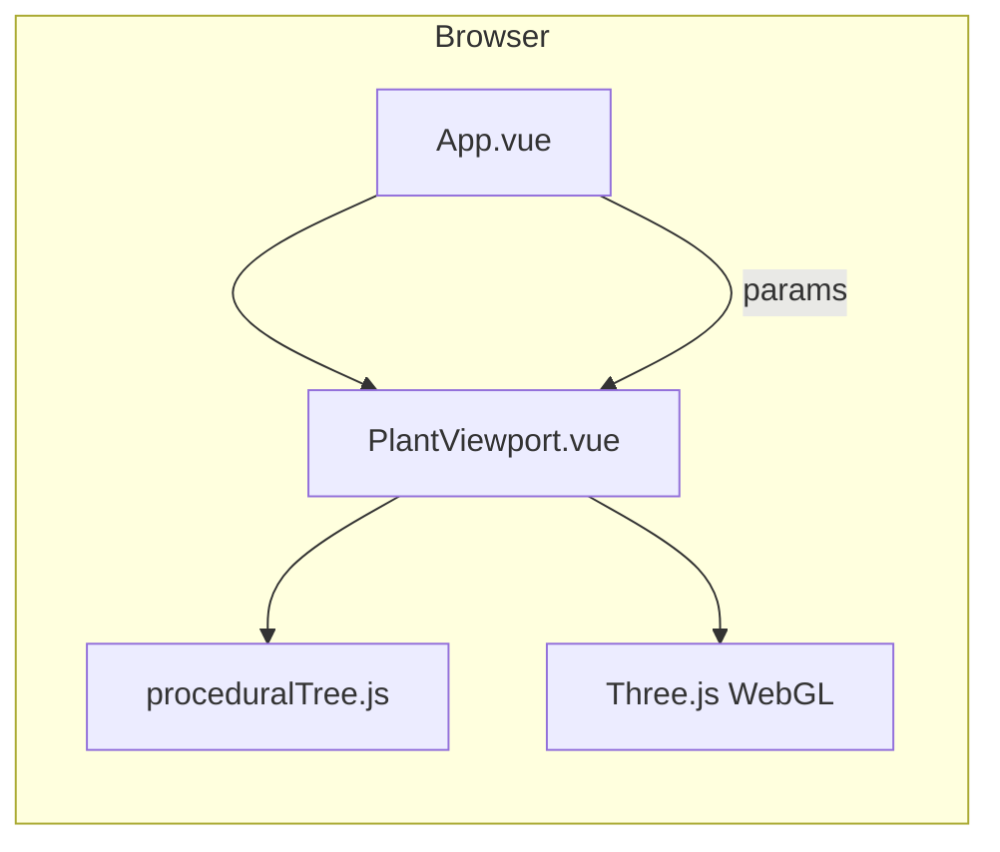

# 组件图（plant-studio）

```mermaid
flowchart LR
  subgraph browser [Browser]
    App[App.vue]
    VP[PlantViewport.vue]
    Gen[proceduralTree.js]
    Three[Three.js WebGL]
    App --> VP
    App -->|params| VP
    VP --> Gen
    VP --> Three
  end
```

- **App.vue**：参数状态与工具栏（随机种子、默认、适配视图、导出）。
- **PlantViewport.vue**：场景生命周期、渲染循环、相机控制、调用生成与导出。
- **proceduralTree.js**：纯算法 + Three 几何构建，无 Vue 依赖。
